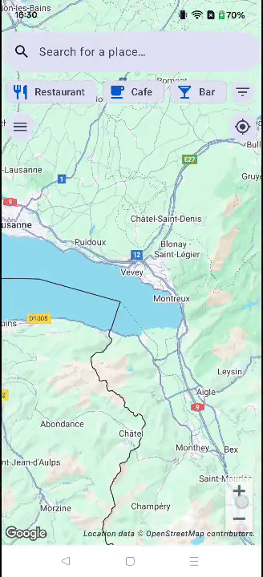
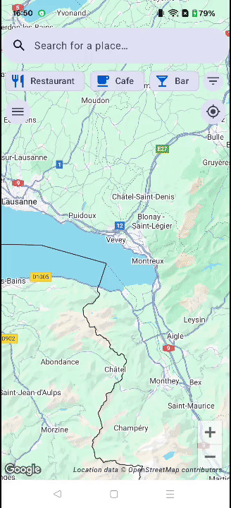

# InWheel

InWheel is an application designed to provide detailed accessibility information for places around Europe. Currently, it operates only in Finland and Switzerland due to limited financial resources for scaling the database. The project aims to empower individuals with mobility disabilities by offering comprehensive accessibility details that are often missing from mainstream mapping services.

## Features

- **Accessibility Data**: Information on entrances, ramps, step counts, restroom accessibility, etc.
- **Localized Focus**: Currently optimized for Finland and Switzerland, with plans for future expansion.
- **Community Contributions**: Users can contribute and verify accessibility data to improve accuracy.

---

## How It Works

InWheel leverages OpenStreetMap (OSM) data as its foundation, enriched with additional accessibility details. The app uses a community-driven approach to ensure the data remains accurate and up-to-date. Users can edit the accessibility details of places directly through the app.

## Credits

Special credit to **Cindy Ribeiro Pinto** who not only made and designed the app logo but also helped define the detailed accessibility criteria that this app is built around.

## Contact

For any questions, feedback, or support, please contact [info@inwheel.ch](mailto:info@inwheel.ch).

## Legal

### Terms & Privacy

- 📜 [Terms of Service](./TERMS.md)
- 🔐 [Privacy Policy](./PRIVACY.md)

### License

This project is licensed under the Apache License 2.0. See the [LICENSE](LICENSE) file for details.

### Database License

The database used by InWheel includes data from [OpenStreetMap](https://www.openstreetmap.org), © [OpenStreetMap contributors](https://www.openstreetmap.org/copyright), and is licensed under the [Open Database License (ODbL) v1.0](https://opendatacommons.org/licenses/odbl/1.0/). Any derived databases must also comply with the terms of the ODbL.

The latest version of the **InWheel Accessibility Dataset** (in CSV format) is available in the [`/data`](./data/) folder of this repository. These files are updated weekly.

> **The derived database “InWheel Accessibility Dataset” is made available under the [Open Database License (ODbL)](https://opendatacommons.org/licenses/odbl/1.0/). Any rights in individual contents of the database are licensed under the [Database Contents License (DbCL)](https://opendatacommons.org/licenses/dbcl/1.0/).**
